# 
 SoundLoCD: An Efficient Conditional Discrete Contrastive Latent Diffusion Model for Text-to-Sound Generation 

 Xinlei Niu1, Jing Zhang1, Christian Walder2, Charles Patrick Martin1 
 
 

 1 Australian National University, Canberra, Australia 

 2 Google DeepMind, Montreal, Canada

## Abstract
We present the SoundLoCD, a novel text-to-sound generation framework, which incorporates a LoRA-based conditional discrete contrastive latent diffusion model. Unlike recent large-scale sound generation models, our method can be efficiently trained under limited computational resources. The integration of a contrastive learning strategy further enhances the connection between textual conditions and the generated outputs, resulting in coherent and high-fidelity performance. Our experiments demonstrate that SoundLoCD outperforms the baseline with greatly reduced computational resources. A comprehensive ablation study further validates the contribution of each component within the SoundLoCD.

## Architecture

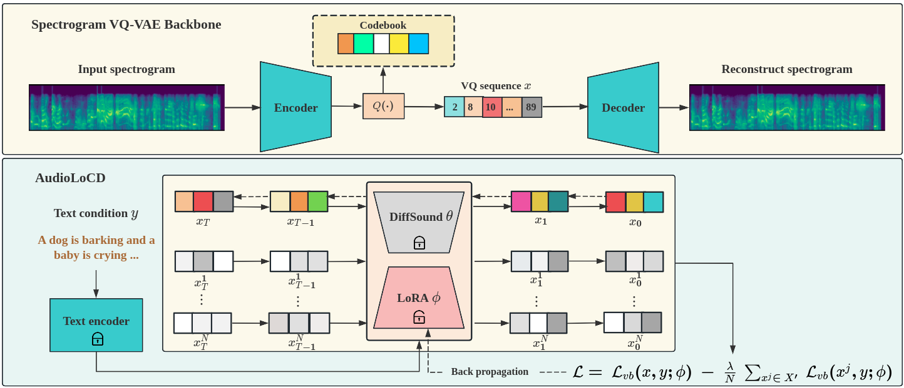

## The comprarison between generated sample by SoundLoCD, DiffSound[1] (baseline), and Ground Truth (Source audio)
<!-- ### The comprarison between generated sample by AudioLoCD, DiffSound[1] (baseline), and Ground Truth -->

| 
Text description
 | 
SoundLoCD
 | 
Diffsound
 |
Ground Truth
|
| :--- | :--- | :--- |
|Food is frying then a woman speaks|<audio src="sample1/AudioLoCD.wav" controls preload></audio>|<audio src="sample1/DiffSound.wav" controls preload></audio>|<audio src="sample1/GT.wav" controls preload></audio>|
|Mel-spectrograms|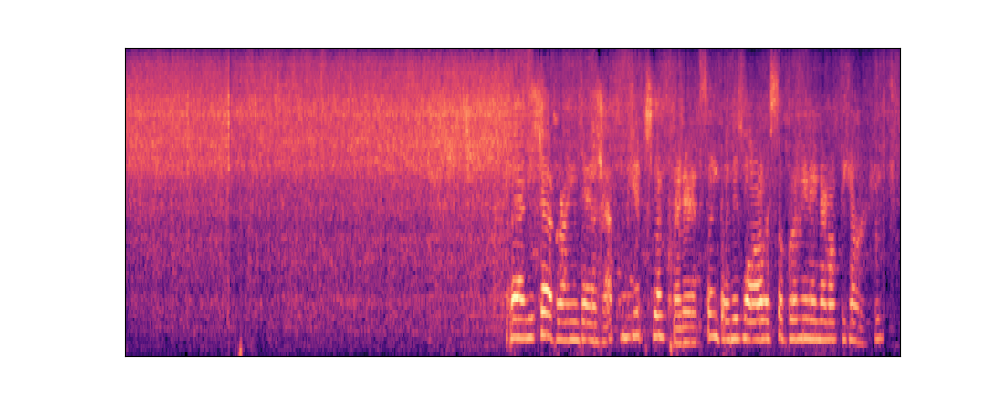|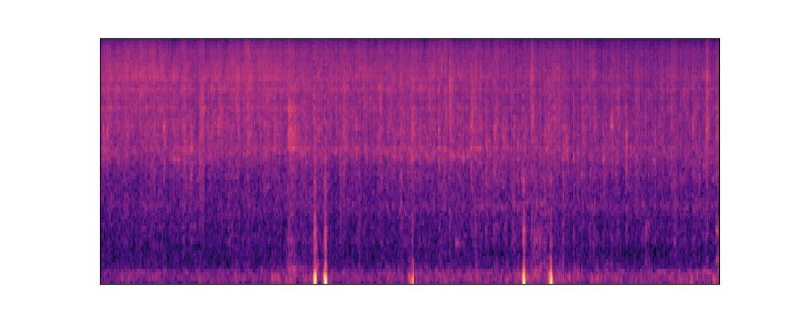|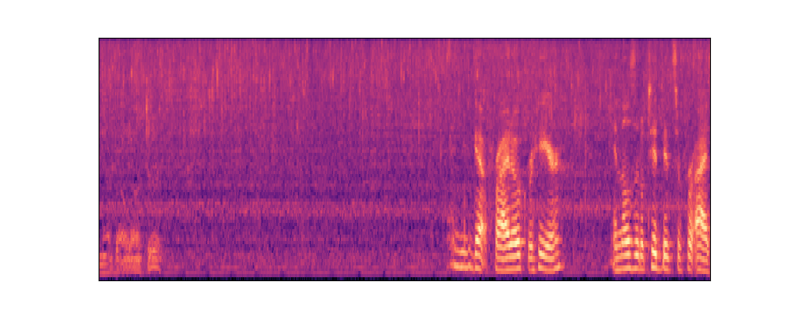|

|Speaking following by laughing and clapping|<audio src="sample2/AudioLoCD2.wav" controls preload></audio>|<audio src="sample2/DiffSound.wav" controls preload></audio>|<audio src="sample2/GT.wav" controls preload></audio>|
|Mel-spectrograms|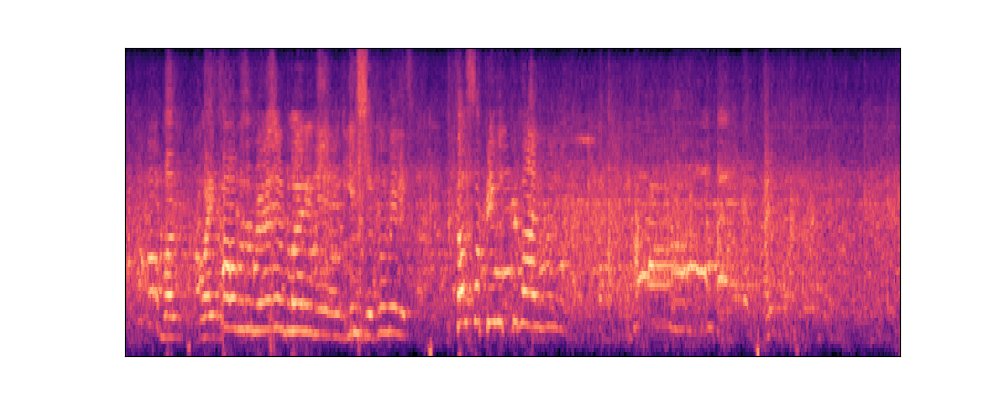|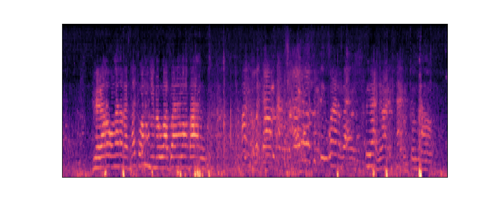|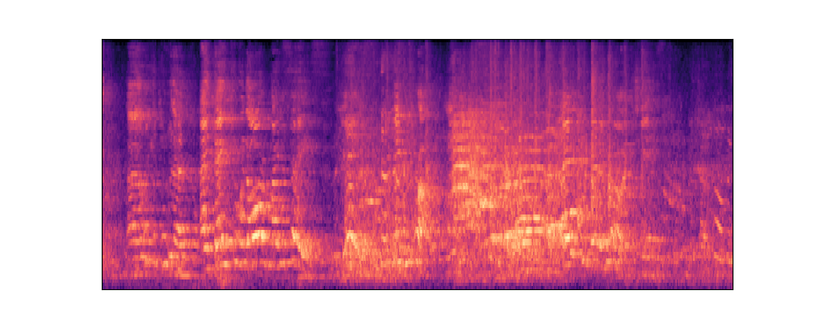|

|A woman speaks as she rubs two objects together|<audio src="sample3/AudioLoCD.wav" controls preload></audio>|<audio src="sample3/DiffSound.wav" controls preload></audio>|<audio src="sample3/GT.wav" controls preload></audio>|
|Mel-spectrograms|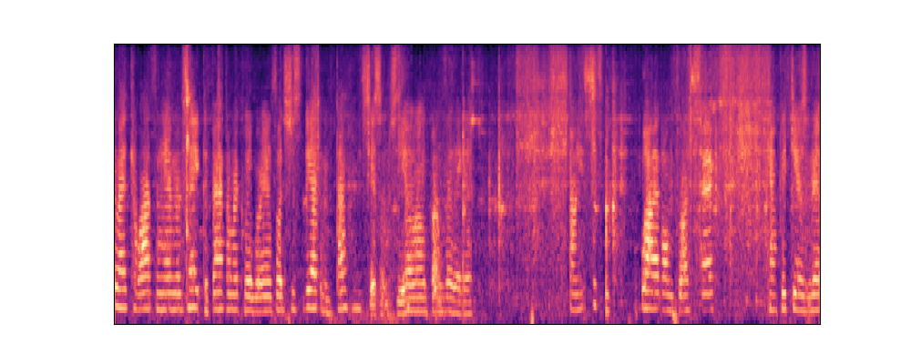|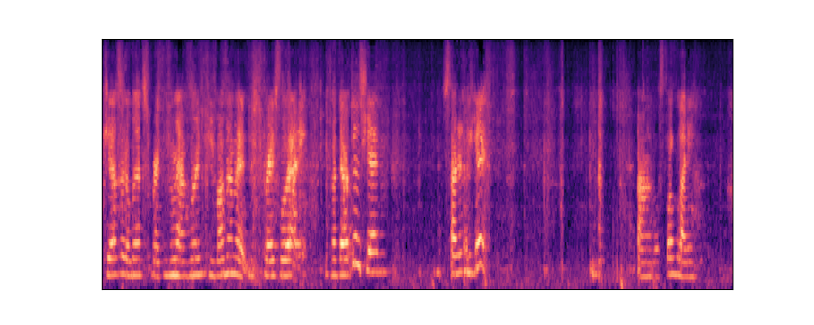|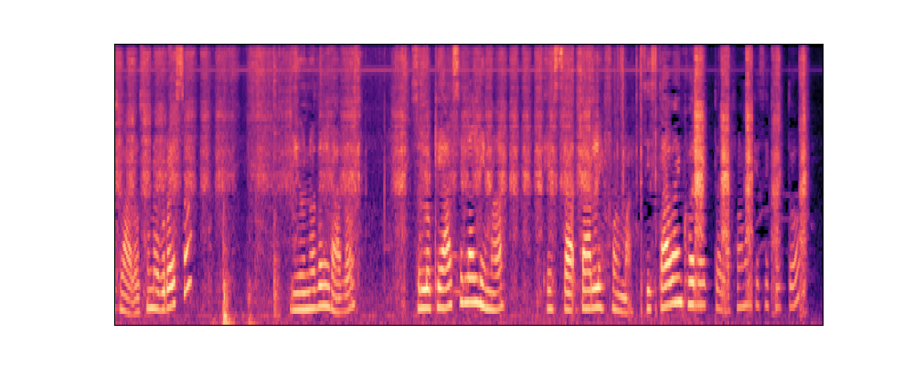|

|A series of light horn beeps is followed by a loud steam whistle|<audio src="sample4/AudioLoCD.wav" controls preload></audio>|<audio src="sample4/DiffSound.wav" controls preload></audio>|<audio src="sample4/GT.wav" controls preload></audio>|
|Mel-spectrograms|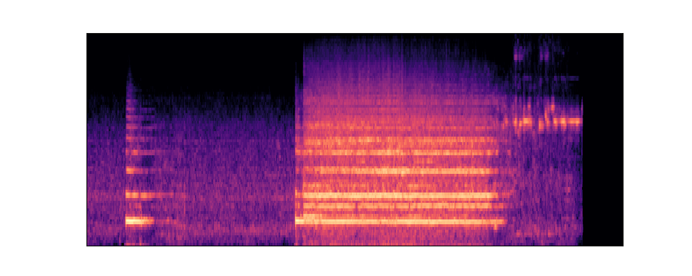|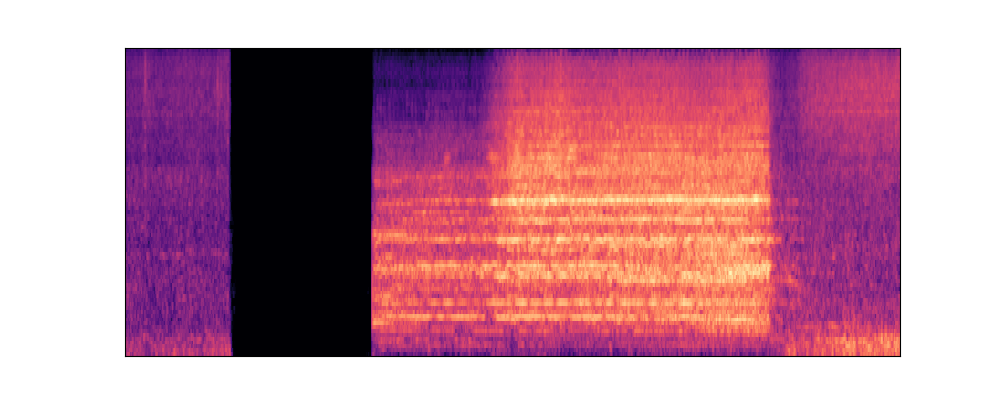|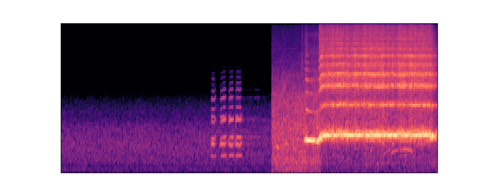|

|An engine runs then a train horn sounds|<audio src="sample5/AudioLoCD.wav" controls preload></audio>|<audio src="sample5/DiffSound.wav" controls preload></audio>|<audio src="sample5/GT.wav" controls preload></audio>|
|Mel-spectrograms|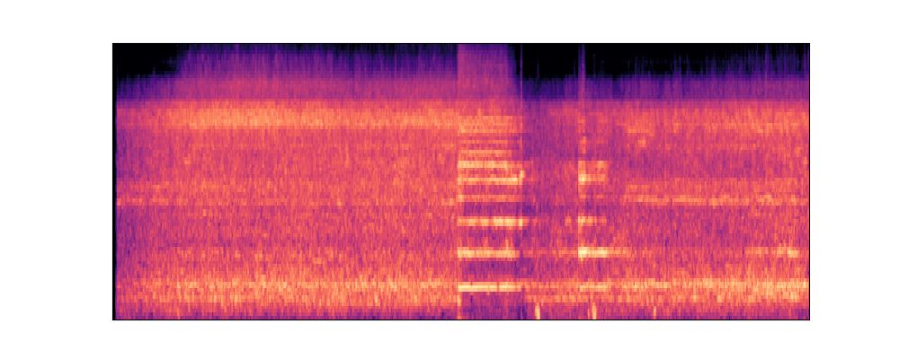|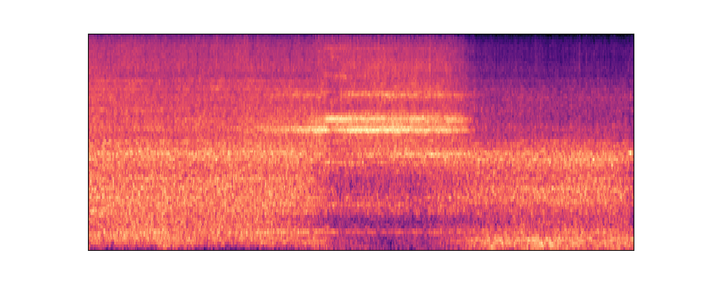|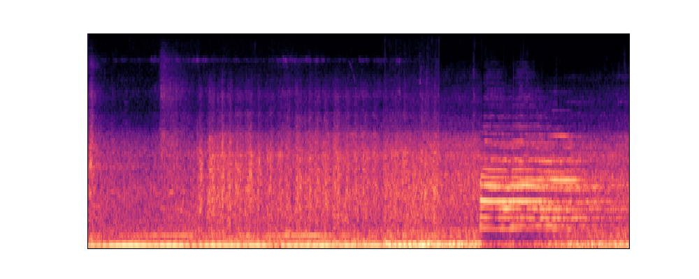|

|A baby cries and fusses, a woman speaks, and a man speaks|<audio src="sample6/AudioLoCD.wav" controls preload></audio>|<audio src="sample6/DiffSound.wav" controls preload></audio>|<audio src="sample6/GT.wav" controls preload></audio>|
|Mel-spectrograms|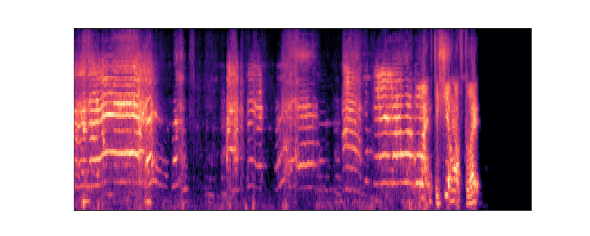|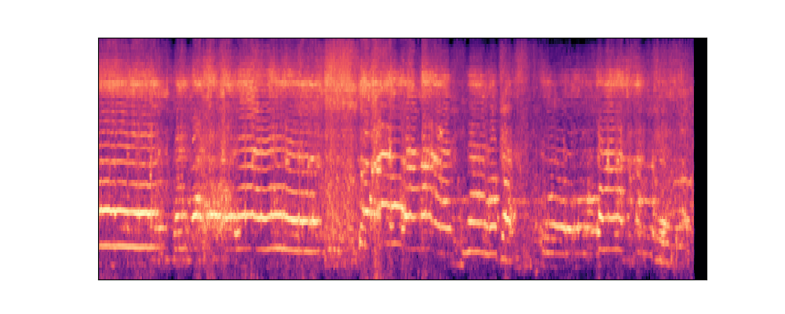|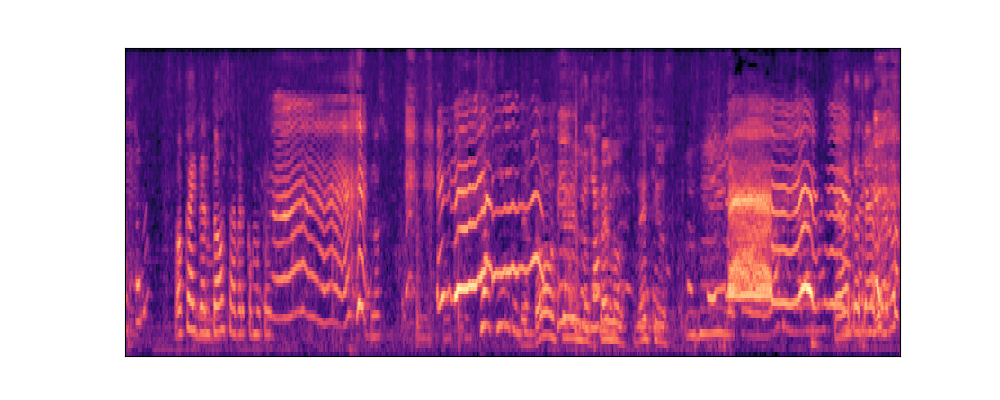|

|Children cry and people talk|<audio src="sample7/AudioLoCD.wav" controls preload></audio>|<audio src="sample7/DiffSound.wav" controls preload></audio>|<audio src="sample7/GT.wav" controls preload></audio>|
|Mel-spectrograms|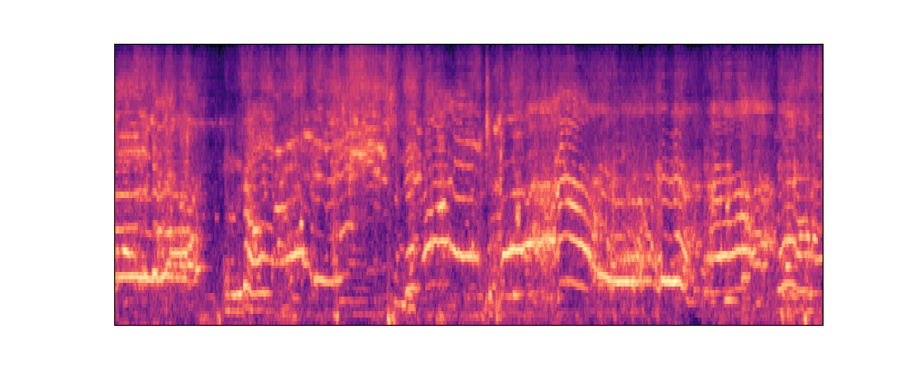|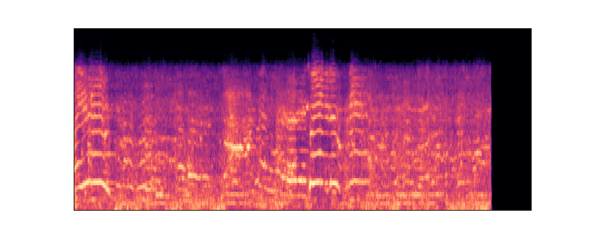|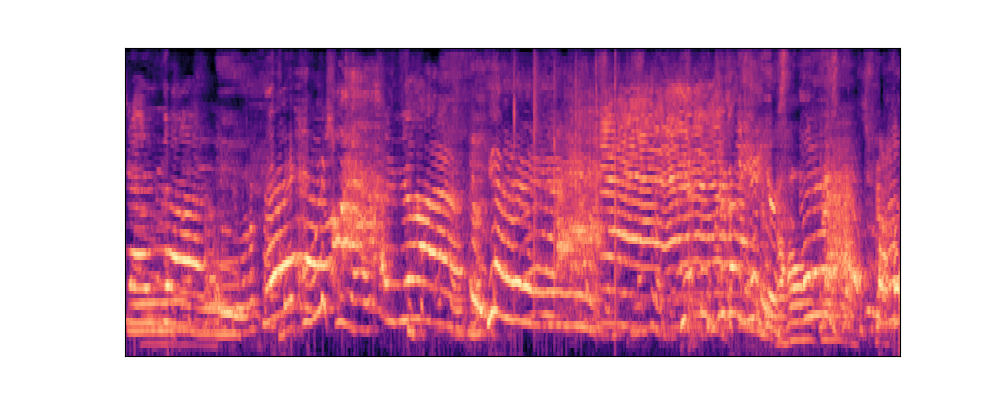|

|A grown man speaks as water softly runs|<audio src="sample8/AudioLoCD.wav" controls preload></audio>|<audio src="sample8/DiffSound.wav" controls preload></audio>|<audio src="sample8/GT.wav" controls preload></audio>|
|Mel-spectrograms|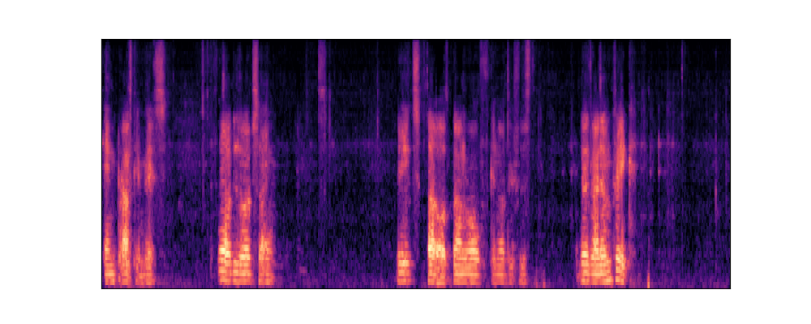|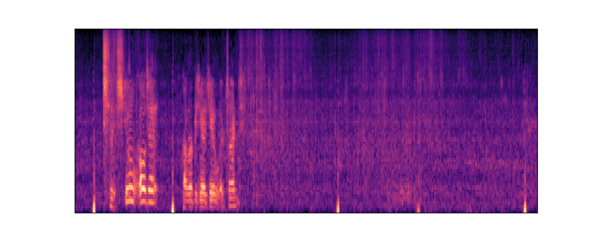|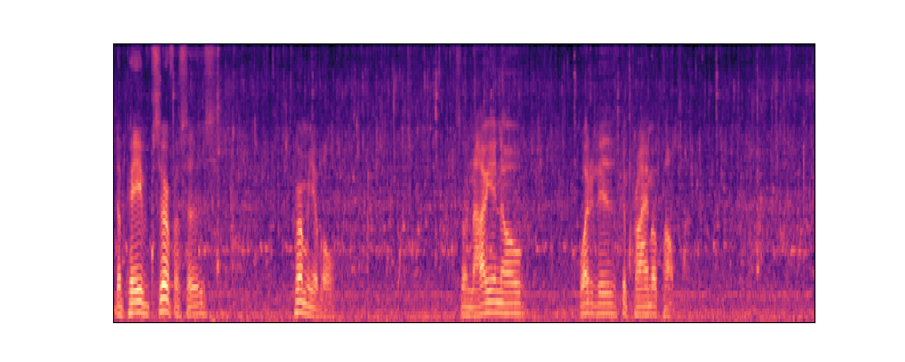|

### References

[1] Yang, Dongchao, et al. "Diffsound: Discrete diffusion model for text-to-sound generation." IEEE/ACM Transactions on Audio, Speech, and Language Processing (2023).